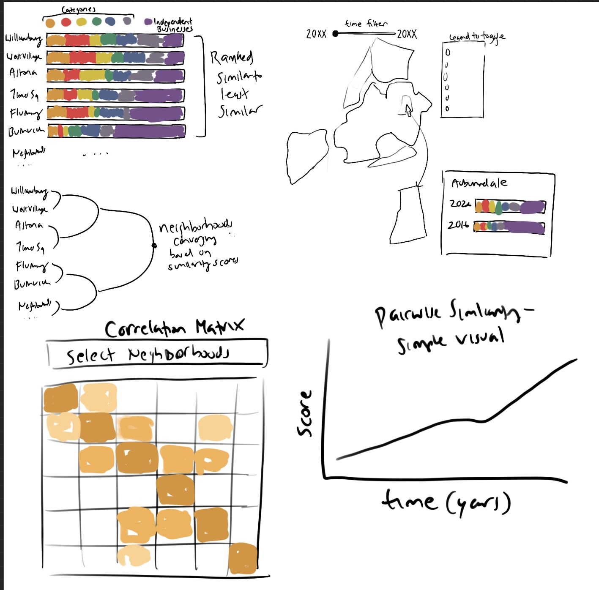
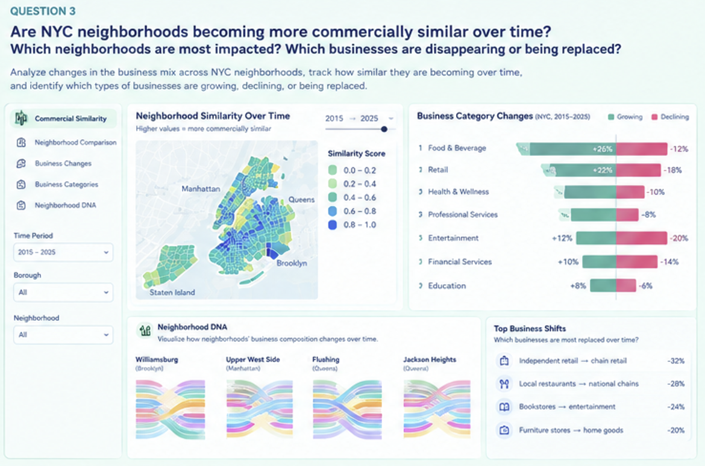

# Mapping the "Same-ification" of NYC Neighborhoods, From Blank Street to 7th Street

**Are NYC neighborhoods truly becoming more commercially homogeneous over time, and which neighborhoods are most impacted by changes such as independent shop replacements and gentrification?**

The "same-ification" is a phenomenon and trend that has recently gained traction, due to the realization that NYC neighborhoods are becoming commercially homogeneous. Popular spots, such as Little Ruby's, 7th Street Burger, Pop-up Bagels, and Blank Street, have been scaling into mini-chains across NYC. As such, neighborhoods like Williamsburg and West Village feel the same with curated and uniform storefronts that have replaced the distinct characteristics that were once there. My project explores neighborhood similarity, the economic impacts on NYC neighborhoods and independent shops and socioeconomic demographics through an interactive geographic visualization.

## Table of Contents
[Week 2: Problem Domain](#week-2-problem-domain)  
[Week 3: Task Analysis](#week-3-task-analysis)  
[Week 4: Validation Analysis](#week-4-validation-analysis)  
[Week 5: North Star Sketch](#week-5-north-star-sketch)  
[Week 6: Project Version 1](#week-6-project-version-1)  

## Week 2: Problem Domain
My goal is to create an interactive visualization that tackles a real problem and question in the NYC area. When I was exploring final project ideas, my domains ranged from climate/public health, to AI & labor, to urban & economic geography. To find this, please see the FINAL_PROJECT_EXPLORATION markdown file. For my final project, I have settled on urban & economic geography. In particular, I'll be exploring the questions:
- Are NYC neighborhoods becoming more commercially similar over time?
- Which neighborhoods are most impacted?
- Which business are disappearing or being replaced?

### Idea
The "same-ification" is a phenomenon/trend that has recently gained traction. The idea is that NYC neighborhoods are becoming the same because popular independent spots have been scaling into mini-chains across NYC. Examples are Little Ruby's, 7th Street Burger, Pop-up Bagels, Blank Street, and more. As such, neighborhoods like Williamsburg and West Village feel the same with curated and uniform storefronts that have replaced the distinct characteristics that once were there. I'm especially interested in this idea because there is potentially in exploring marketing themes, looking at economic impacts, potentially socioeconomic demographics, while creating an interactive visualization. The "same-ificiation" of NYC is a topic that really came about this past year so it is incredibly relevant.

### Related Work
[Blog Article](https://chefjesseconsulting.biz/blog/nyc-restaurant-same-ification), 
[NYC Comptroller Report](https://comptroller.nyc.gov/reports/whos-minding-the-storefronts/?utm_source=chatgpt.com)

### Potential Datasets
- NYC Opeen Data businesses
- OpenStreetMap
- Yelp
- TikTok Data if possible - how does TikTok impact the same-ification?
- Commercial rent data
- Property values
- Foot traffic/tourism
- New construction sites, gentrification zones

### Rough Sketches

## Week 3: Task Analysis
I want to explore how NYC neighborhoods are becoming more commercially similar over time and identify neighborhoods that are experiencing the most changes. The visualization will help users compare businesses across neighborhoods and time periods by identifying patterns of homogenization or diversification. This may be done by assigning scores based on what stores are in each neighborhood. Additionally, I will explore what types of businesses are opening, closing, or being replaced. Other areas to touch upon are if changes are in particular neighborhoods or periods of development, and where independent businesses face the most pressure.

## Week 4: Validation Analysis

### Domain Situation
For the final visual, users will be looking at how the composition of businesses in NYC neighborhoods change over time and whether neighborhoods are becoming more similar. Ideal users would then be NYC residents, urban researchers, community organizations, and city planners. 

### Data/Task Abstraction
Task:
- Compare the business composition of neighborhoods
- Browse commercial characteristics across NYC
- Identify neighborhoods with substantial change.
- Track changes in business composition over time.
- Summarize the composition of specific neighborhoods.

Data:
- Spatial: neighborhoods
- Categorical: business categories
- Quantitative: number of businesses and other metrics such as money, visitors, customers, etc.
- Temporal: businesses across years
- Relational: similarities between neighborhoods.

### Visual Encoding/Interaction Idiom
For this visual, it could be reprsented with an interatcive map along with a similarity matrix, or a visual that shows the business composition of neighborhoods. It should have a time filter, colors to differentiate business compositions, neighborhood selection, tooltips, etc.

### Algorithm
The algorithm would have to be able to ategorize businesses into standardized categories, convert neighborhoods into a business-category relation, calculate the pairwise similarity between neighborhoods, do this for different time periods, and identify businesses/categories/neighborhoods with substantial changes. This will need to be done for different filter settings.

## Week 5: North Star Sketch
North Star sketches were generated by ChatGPT (GPT-5.6 Luna, free vers up to daily limit). I wanted to give a shot at using AI to generate the sketches. As evident, the LLM-generated visual has some incomprehensible numbers. I made a few edits by prompting what I wanted to change or see, including the graph styles and the neighborhood "DNA". There are definitely changes I'd like to make when I create and iterate through my real visualization, including an interactive map where users can zoom in and out, and explore neighborhood demographics. However, I think this is still a good starting point for what my final project should look for.

## Week 6: Project Version 1
In Week 6, I design a first rough version that gets me closer to my final vision for the project. You can view the visualization under week 6 in my GitHub pages, linked below.

Limitations Discovered:
- NYC neighborhood boundaries are not officially designated. The closest official dataset is NTAs, which is based on the census tract and merge some neighborhoods. Other datasets are interpretations amongst many, which makes the task even more difficult.
- My restaurant dataset is the official NYC violation citations dataset and restaurants without citations are still listed. However, restaurants without coordinates are dropped.
- Coordinates are approximate, not official storefronts. Additionally, restaurants are sorted to the closest neighborhood based on where it lies in the Geo JSON boundary, which may make results different from map to map.
- Chains are calculated based on locations in NYC, not world-wide, which could impact validity.

[Link to Page](https://brian-jin.github.io/data-visualization-student-starter/?example=6)