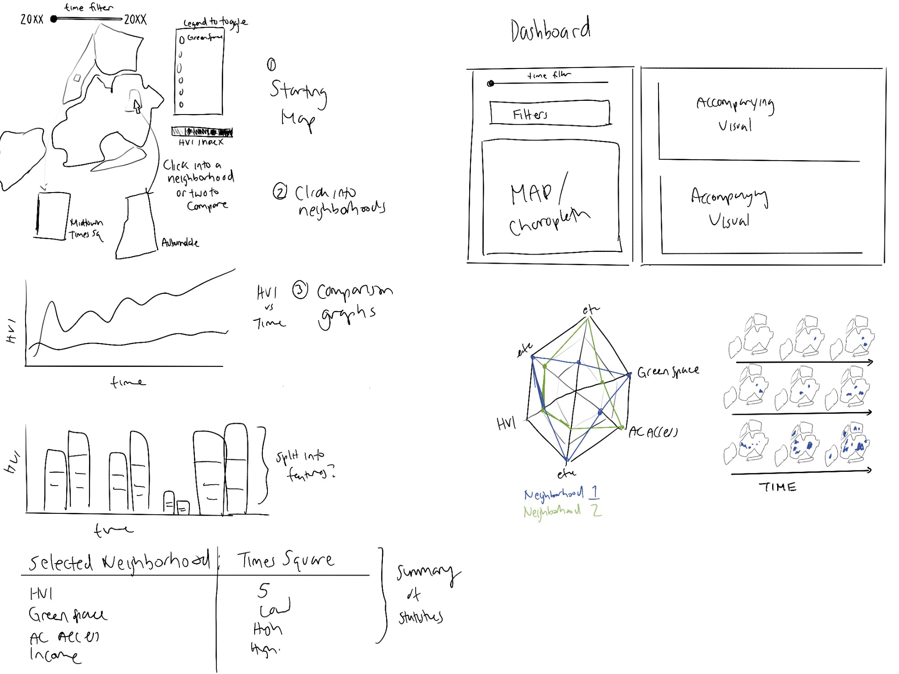
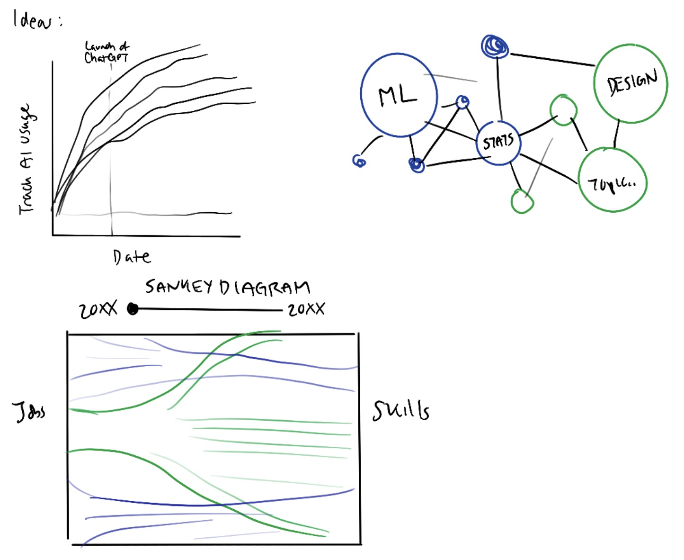
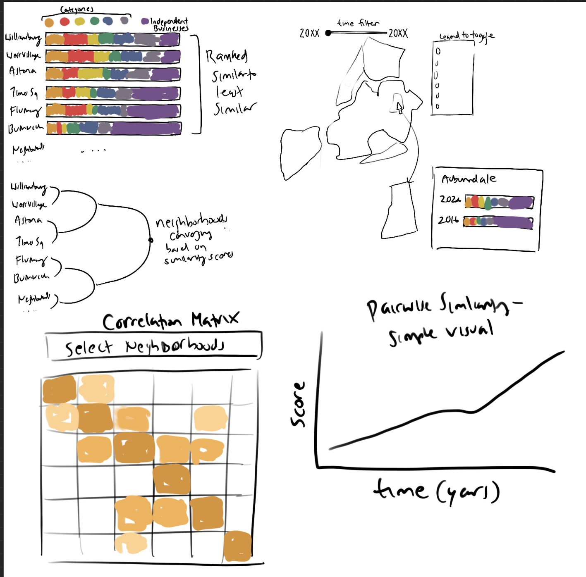

# Final Project Exploration 1

Sketches are drawn by hand on Procreate app (iPad).

### Domain
My domain ranges from question to question. I'd love to create an interactive visualization that tackles a real problem and question in the NYC area. My domains range from climate/public health, to AI & labor, to urban & economic geography. 

## Question 1: How is a changing/subtropical climate affecting different groups of New Yorkers?
### Idea
I thought of this idea because it seems like every year the weather in NYC is getting hotter and more humid. In comparison to my childhood, I can't recall the humidity in the summers being so unbearable. In 2020, NYC even transitioned into a sub-tropical climate.

I'd then like to explore how this idea is impacting different neighborghoods in terms of socioeconomic demographics as well as green spaces in NYC. 
### Related Work
[The NYC Heat Vulnerability Index](https://a816-dohbesp.nyc.gov/IndicatorPublic/data-features/hvi/?utm_source=chatgpt.com)
Expanding onto the NYC HVI, which is already an extensive data visualization project, I'd like to explore more neighborhood-specific components in creating the HVI score. The visualization currently does not offer this, instead giving a more high-level overview of components (green space, demographics) and only a HVI score when clicking into a neighborhood. Other changes I can replicate and explore are comparing HVI scores between neighborhoods, especially if they are the same but are impacted by different components. Finally, I am wondering if it is possible to collect data on time so that I can create an interactive time-series visualization. 
[2026 Heat-Related Mortality Report](https://a816-dohbesp.nyc.gov/IndicatorPublic/data-features/heat-report/)
### Potential Datasets
NYC Heat Vulnerability Index
NYC Climate Data
NYC Tree Census
NYC Parks and Open Data
NOAA Weather Data
### Rough Sketches

## Question 2: How is AI changing the skills employers want?
### Idea
AI is changing the skills, occupations, and qualifications that employers are looking for. As AI integrates into more jobs, it'll be interesting to see what employers are asking for. I wonder how this impacts different industries as well, not just tech and finance. Does AI even impact blue collar jobs? Are education requirements changing as well? I'd like to explore this for the NYC region as that is where I am applying for jobs and potentially expand it to compare nation-wide or region-wide (Northeast)
### Related Work
[Anthropic Economic Index](https://www.anthropic.com/economic-index#job-explorer)
### Potential Datasets
O*NET
Anthropic Data
OpenAI Data
NYC Jobs
U.S. Bureau of Labor Statistics
NYC Employment Data
### Rough Sketches

## Question 3: Are NYC neighborhoods becoming more commercially similar over time? Which neighborhoods are most impacted? Which business are disappearing or being replaced? 
### Idea
The "same-ification" is a phenomenon/trend that has recently gained traction. The idea is that NYC neighborhoods are becoming the same because popular independent spots have been scaling into mini-chains across NYC. Examples are Little Ruby's, 7th Street Burger, Pop-up Bagels, Blank Street, and more. As such, neighborhoods like Williamsburg and West Village feel the same with curated and uniform storefronts that have replaced the distinct characteristics that once were there. I'm especially interested in this idea because there is potentially in exploring marketing themes, looking at economic impacts, potentially socioeconomic demographics, while creating an interactive visualization. The "same-ificiation" of NYC is a topic that really came about this past year so it is incredibly relevant.
### Related Work
[Article](https://chefjesseconsulting.biz/blog/nyc-restaurant-same-ification)
[NYC Comptroller](https://comptroller.nyc.gov/reports/whos-minding-the-storefronts/?utm_source=chatgpt.com)
### Potential Datasets
NYC Opeen Data businesses
OpenStreetMap
Yelp
TikTok Data if possible - how does TikTok impact the same-ification?
Commercial rent data
Property values
Foot traffic/tourism
New construction, gentrification
### Rough Sketches
